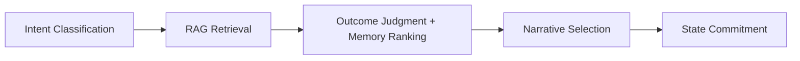
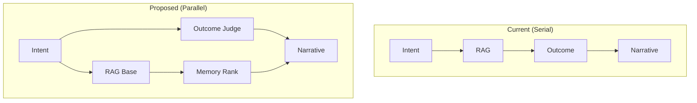
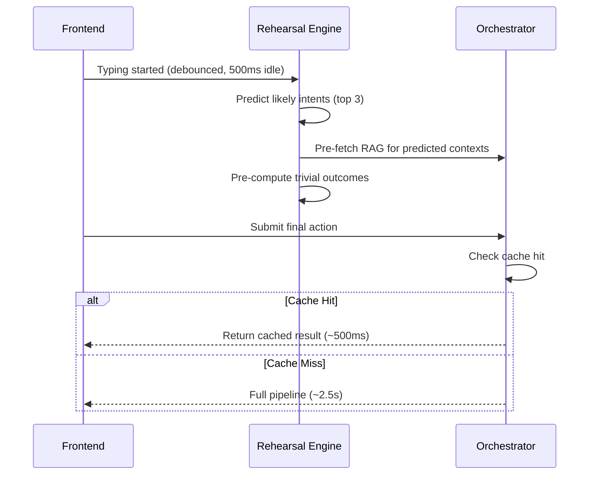
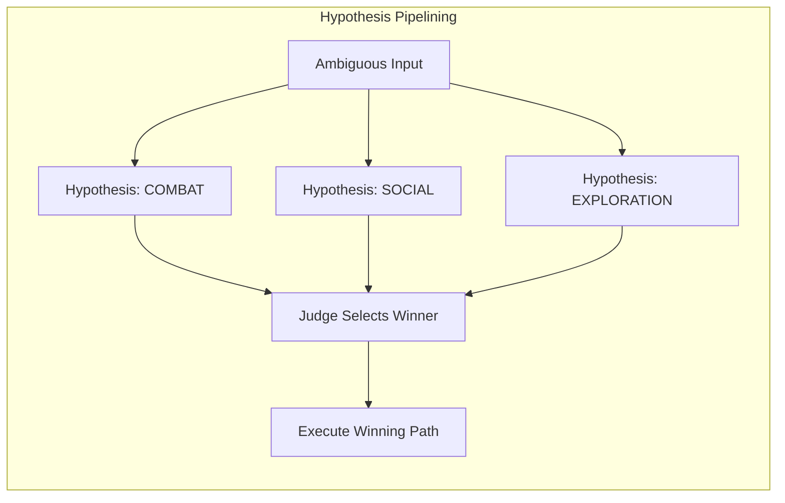

# AIDM v3 Multi-Domain Architectural Audit

A comprehensive technical roadmap for optimizing AIDM v3 for high-fidelity anime storytelling and reliable agentic orchestration.

---

## Executive Summary

This audit analyzes the AIDM v3 "Anime Studio" architecture across five domains: **Orchestration Logic**, **State Integrity**, **Mechanical/Narrative Hybridization**, **Prompt Engineering/RAG**, and **Agency/Decision Point Detection**. The recommendations prioritize replacing hardcoded logic with agentic reasoning and leveraging modern long-context models for planning.

> [!IMPORTANT]
> The current architecture is already impressively stable (verified by Jan 15 forensic audits), but several opportunities exist to improve latency, state coherence, and dynamic narrative adaptation.

---

## Domain 1: Orchestration Logic & Latency

### 1.1 Current Pipeline Analysis

The current `Orchestrator.process_turn` in [orchestrator.py](file:///c:/Users/admin/Downloads/animerpg/aidm_v3/src/core/orchestrator.py) follows a **5-phase sequence**:



**Current Latency Breakdown (Estimated):**

| Phase | Agent(s) | Current Tier | Est. Latency |
|-------|----------|--------------|--------------|
| 1a | [IntentClassifier](file:///c:/Users/admin/Downloads/animerpg/aidm_v3/src/agents/intent_classifier.py#32-95) | Fast | ~200ms |
| 1a.5 | `WorldBuilderAgent` (conditional) | Fast | ~300ms |
| 1b | `ContextSelector` + ChromaDB | N/A | ~150ms |
| 2 | `OutcomeJudge` + `MemoryRanker` (parallel) | Fast | ~400ms |
| 3 | [KeyAnimator](file:///c:/Users/admin/Downloads/animerpg/aidm_v3/src/agents/key_animator.py#14-358) OR [SakugaAgent](file:///c:/Users/admin/Downloads/animerpg/aidm_v3/src/agents/sakuga.py#5-69) | Creative | ~1500ms |
| 4 | NPC/Combat/Progression | Fast | ~300ms |
| 5 | State Commit (sync) | N/A | ~50ms |
| **Total** | | | **~2.9s** |

> [!TIP]
> The current pipeline is **close to the 3-second target** for standard turns. The bottleneck is narrative generation (Phase 3).

### 1.2 Dependency Graph Optimization

The current dependency graph has **serial bottlenecks** that can be parallelized:



**Recommendation: Phase 2 Pre-Computation**

The `OutcomeJudge` and `MemoryRanker` already run in parallel (lines 375-397 in [orchestrator.py](file:///c:/Users/admin/Downloads/animerpg/aidm_v3/src/core/orchestrator.py)). However, this can be extended:

```python
# PROPOSED: Start RAG retrieval immediately after Intent (don't wait for full context)
# Phase 1a+1b should overlap
async def process_turn(self, player_input: str, ...):
    # Fire Intent and RAG Base in parallel
    intent_task = asyncio.create_task(self.intent_classifier.call(...))
    rag_base_task = asyncio.create_task(self.context_selector.get_base_context(...))
    
    # Wait for Intent (needed for routing decisions)
    intent = await intent_task
    
    # Intent-dependent branching can start while RAG completes
    if intent.intent == "WORLD_BUILDING":
        # WorldBuilder can begin without full RAG
        wb_task = asyncio.create_task(world_builder.call(...))
```

**Estimated Latency Improvement:** ~300ms (10%)

---

### 1.3 Speculative Execution Proposal

**Concept:** Pre-run likely outcomes while the player is still typing.

**Architecture: The "Rehearsal" System**



**Implementation Strategy:**

1. **Frontend Hook:** Debounced `onInput` event sends partial text after 500ms of idle time.
2. **Rehearsal Endpoint:** New `/api/game/rehearse` endpoint that accepts partial input.
3. **Intent Prediction:** Lightweight classifier (can be regex-based for common patterns) predicts top 3 likely intents.
4. **Cache Warming:**
   - Pre-fetch RAG chunks for predicted contexts
   - Pre-compute `OutcomeJudge` results for trivial actions
   - Warm the [SakugaAgent](file:///c:/Users/admin/Downloads/animerpg/aidm_v3/src/agents/sakuga.py#5-69) prompt template if combat keywords detected
5. **Cache Policy:** Evict speculative results after 10 seconds or on new input.

**Risk Analysis:**

| Risk | Mitigation |
|------|------------|
| Wasted computation | Only pre-compute Fast-tier operations; never start Creative-tier narrative |
| State desync | Speculative execution is read-only; no state mutations until final submit |
| Cost overhead | Use Gemini 3 Flash (cheapest) for all rehearsal operations |

**Expected Latency Improvement:** 40-60% for common action types (EXPLORATION, ABILITY, simple SOCIAL).

#### 1.3.1 Hypothesis Pipelining (Post-Submit Disambiguation)

For **ambiguous inputs** (e.g., "I engage him"), the Orchestrator can leverage Gemini 3 Flash's speed to run multiple intent hypotheses in parallel:



**When to Trigger:**
- Intent confidence < 0.7
- Input contains multi-intent keywords ("engage", "approach", "confront")
- Player history shows frequent intent switching

**When to Skip:**
- Clear intent signals ("I attack", "I ask her", "I search")
- Single-intent keywords with high confidence

> [!NOTE]
> Hypothesis Pipelining complements pre-typing Rehearsal. Rehearsal handles **likely** outcomes; Pipelining handles **ambiguous** outcomes.

---

### 1.4 Per-Agent Model Selection: Optimizing Gemini 3.0 Flash for "Assistant" Roles

**Current State:** The system already implements tiered model selection in [store.py](file:///c:/Users/admin/Downloads/animerpg/aidm_v3/src/settings/store.py).

**Optimization Strategy for 100% Schema Compliance:**

For structured-output agents ([IntentClassifier](file:///c:/Users/admin/Downloads/animerpg/aidm_v3/src/agents/intent_classifier.py#32-95), `OutcomeJudge`, `WorldBuilderAgent`, `Validator`), Gemini 3.0 Flash needs:

1. **Strict JSON Mode Enforcement:**
   ```python
   # In BaseAgent.call or provider.complete_with_schema
   response = provider.complete(
       ...,
       response_format={"type": "json_object"},  # Enforce JSON output
       temperature=0.1,  # Low temperature for determinism
   )
   ```

2. **Schema Preloading in System Prompt:**
   ```
   You MUST respond with a JSON object matching this exact schema:
   {schema}
   
   Do not include any text before or after the JSON.
   ```

3. **Retry with Schema Correction:**
   ```python
   for attempt in range(3):
       try:
           result = await agent.call(...)
           return schema.model_validate(result)
       except ValidationError as e:
           # Retry with error context
           correction = f"Previous output failed validation: {e}"
   ```

**Reasoning Depth Enhancement:**

For agents requiring deeper reasoning while staying on Flash tier:

```python
# In IntentClassifier system_prompt
"""
Before outputting JSON, reason through these questions internally:
1. What is the player's PRIMARY goal?
2. Are there SECONDARY effects (world-building assertions)?
3. What tropes or conditions apply?

Then output your structured response.
"""
```

> [!NOTE]
> Gemini 3.0 Flash has "internalized System 2 reasoning" per the 2026 model analysis. Explicit CoT in prompts is largely redundant but can help with edge cases.

---

## Domain 2: State Integrity & Context Management

### 2.1 Atomic Transactions Audit

**Current State:** The [StateManager](file:///c:/Users/admin/Downloads/animerpg/aidm_v3/src/db/state_manager.py) uses SQLAlchemy sessions for persistence, but lacks explicit transaction boundaries for multi-schema updates.

**The Problem: State Amnesia/Desync**

When a single turn affects multiple schemas:

```
Turn: "I reveal my secret identity to my mentor and join his faction"
Affected Schemas:
  - Character (identity_revealed flag)
  - NPC (mentor affinity change)
  - Faction (membership update)
  - WorldState (faction_context change)
  - Memory (relationship milestone)
```

If any write fails mid-sequence, the state becomes inconsistent.

**Proposed Solution: Transaction Manager**

```python
# NEW: src/core/state_transaction.py

class StateTransaction:
    """Atomic transaction wrapper for multi-schema updates."""
    
    def __init__(self, state_manager: StateManager, memory_store: MemoryStore):
        self.state = state_manager
        self.memory = memory_store
        self._changes: List[Callable] = []
        self._rollback: List[Callable] = []
    
    def queue_character_update(self, **kwargs):
        """Queue a character schema change."""
        self._changes.append(lambda: self.state.update_character(**kwargs))
        # Store rollback (fetch current state before change)
        old_state = self.state.get_character()
        self._rollback.append(lambda: self.state.update_character(**old_state.__dict__))
    
    def queue_npc_affinity(self, npc_id: int, delta: int, reason: str):
        """Queue an NPC affinity change."""
        old_affinity = self.state.get_npc_affinity(npc_id)
        self._changes.append(lambda: self.state.update_npc_affinity(npc_id, delta, reason))
        self._rollback.append(lambda: self.state.set_npc_affinity(npc_id, old_affinity))
    
    def queue_memory(self, content: str, memory_type: str, **kwargs):
        """Queue a memory addition."""
        self._changes.append(lambda: self.memory.add_memory(content, memory_type, **kwargs))
        # Memories are append-only; rollback marks as deleted
    
    async def commit(self) -> bool:
        """Execute all changes atomically."""
        with self.state._get_db().begin():  # SQLAlchemy transaction context
            try:
                for change in self._changes:
                    change()
                return True
            except Exception as e:
                # Rollback all changes
                for rb in reversed(self._rollback):
                    try:
                        rb()
                    except:
                        pass
                raise TransactionError(f"State commit failed: {e}")
```

**Integration Point:** Replace direct `update_*` calls in [orchestrator.py](file:///c:/Users/admin/Downloads/animerpg/aidm_v3/src/core/orchestrator.py) (lines 690-741) with transaction queuing.

---

### 2.2 Change Log Protocol Enhancement

**Current State:** The `Turn` model records `state_changes` as a JSON blob, but this is populated inconsistently.

**Proposed: Structured Change Log**

```python
# Enhanced Turn model in models.py

class StateChange(BaseModel):
    """A single atomic state change."""
    schema: Literal["character", "npc", "world", "faction", "memory"]
    operation: Literal["create", "update", "delete"]
    entity_id: Optional[str]
    field: str
    old_value: Any
    new_value: Any
    timestamp: datetime

class Turn(Base):
    # ... existing fields ...
    state_changes: List[StateChange] = []  # Structured, not blob
```

**Benefits:**
- **Undo/Redo:** Precise rollback without snapshot comparison
- **Debugging:** Clear audit trail for state amnesia investigations
- **Compression:** Old turns can drop values, keeping only high-level change types

#### 2.2.1 Event Sourcing Extension

To enable full **Time Travel Debugging** and reproducibility, extend the change log to capture not just outputs but inputs:

```python
# Extended Turn model for Event Sourcing

class TurnEvent(BaseModel):
    """Full event record for replay capability."""
    # Inputs
    player_input: str
    random_seed: int  # For deterministic replay
    intent_probabilities: Dict[str, float]  # All hypotheses, not just winner
    
    # Decisions
    selected_intent: str
    outcome_result: OutcomeResult
    
    # Outputs
    state_changes: List[StateChange]
    narrative_hash: str  # For drift detection
    
    # Metadata
    model_versions: Dict[str, str]  # Which model version per agent
    timestamp: datetime
```

**Benefits:**
- **Replay Sessions:** Re-run any turn with identical results
- **A/B Testing:** Compare model versions without live players
- **Butterfly Debugging:** Identify which turn caused downstream issues

---

### 2.3 Memory Thread & Heat Index: Dynamic Decay Algorithm

**Current State:** [memory.py](file:///c:/Users/admin/Downloads/animerpg/aidm_v3/src/context/memory.py) implements heat-based decay with fixed rates (`fast`, `normal`, `slow`, `none`).

**The Problem: Long-Form Campaign Context Drift**

In 100+ turn campaigns:
- Early "core" memories may still have high heat (decay=none) but become contextually irrelevant
- Plot-critical seeds planted in turn 30 may cool off before payoff in turn 80
- Memory store grows large, degrading retrieval quality

**Proposed: Adaptive Narrative Decay Algorithm**

```python
# Enhanced decay logic in MemoryStore.decay_heat

def adaptive_decay(self, memory: Memory, current_turn: int, arc_context: ArcContext) -> float:
    """
    Calculate adaptive decay based on narrative context.
    
    Factors:
    1. Base decay rate (fast/normal/slow/none)
    2. Arc relevance (is this memory relevant to current arc?)
    3. Entity activation (was the related entity mentioned recently?)
    4. Plot seed detection (does this memory contain unresolved foreshadowing?)
    """
    base_decay = DECAY_RATES[memory.decay_rate]
    
    # Factor 1: Arc relevance multiplier
    arc_keywords = arc_context.get_active_keywords()
    memory_keywords = extract_keywords(memory.content)
    arc_overlap = len(set(arc_keywords) & set(memory_keywords)) / max(len(arc_keywords), 1)
    arc_multiplier = 1.0 - (arc_overlap * 0.5)  # 0.5-1.0 range
    
    # Factor 2: Entity activation
    mentioned_entities = arc_context.get_recently_mentioned_entities(window=5)
    memory_entities = memory.metadata.get("entities", [])
    if any(e in mentioned_entities for e in memory_entities):
        return 0.0  # No decay if entity was just mentioned
    
    # Factor 3: Plot seed protection
    if "unresolved_seed" in memory.flags or "foreshadowing" in memory.flags:
        return base_decay * 0.1  # 90% slower decay for seeds
    
    # Factor 4: Recency boost for "plot_critical"
    if "plot_critical" in memory.flags:
        turns_since_access = current_turn - memory.metadata.get("last_access_turn", 0)
        if turns_since_access < 20:
            return 0.0  # No decay for recently accessed critical memories
    
    return base_decay * arc_multiplier
```

**Foreshadowing Ledger Integration:**

The existing [foreshadowing.py](file:///c:/Users/admin/Downloads/animerpg/aidm_v3/src/core/foreshadowing.py) should tag memories with `foreshadowing` flag when seeds are planted:

```python
# In ForeshadowingLedger
def plant_seed(self, content: str, payoff_keywords: List[str], memory_id: str):
    """Register a foreshadowing seed."""
    self.seeds.append({
        "memory_id": memory_id,
        "payoff_keywords": payoff_keywords,
        "planted_turn": self.current_turn,
        "status": "unresolved"
    })
    # Mark the memory
    self.memory_store.add_flag(memory_id, "foreshadowing")
    self.memory_store.add_flag(memory_id, "unresolved_seed")
```

---

## Domain 3: Mechanical & Narrative Hybridization

### 3.1 Logic Plugin Shape-Shifting

**Current State:** Combat resolution in [combat.py](file:///c:/Users/admin/Downloads/animerpg/aidm_v3/src/agents/combat.py) is relatively generic. The `NarrativeProfile` contains DNA scales but these don't deeply alter mechanical logic.

**Proposed: Plugin Architecture with Profile-Driven Behavior**

```python
# NEW: src/plugins/combat_plugins.py

class CombatPlugin(Protocol):
    """Interface for combat system plugins."""
    
    def calculate_hit(self, attacker: Character, defender: Entity, action: CombatAction) -> float:
        """Calculate hit probability (0.0-1.0)."""
        ...
    
    def calculate_damage(self, base_damage: int, context: CombatContext) -> int:
        """Calculate final damage."""
        ...
    
    def get_narrative_weight(self, result: CombatResult) -> Literal["minor", "significant", "climactic"]:
        """Determine narrative importance of this combat action."""
        ...


class TacticalCombatPlugin(CombatPlugin):
    """For: Demon Slayer, Attack on Titan, HxH"""
    
    def calculate_hit(self, attacker, defender, action):
        # Heavy emphasis on positioning, resources, stamina
        base = 0.5
        base += attacker.stats.agility * 0.02
        base -= defender.stats.defense * 0.01
        base += action.stance_advantage * 0.15
        return min(0.95, max(0.05, base))


class SpiritCombatPlugin(CombatPlugin):
    """For: Bleach, Naruto, JJK"""
    
    def calculate_hit(self, attacker, defender, action):
        # Spirit pressure/willpower determines hit
        reiatsu_diff = attacker.stats.spirit - defender.stats.spirit
        base = 0.5 + (reiatsu_diff * 0.05)
        if action.is_named_attack:
            base += 0.2  # Named attacks are more likely to land
        return min(0.95, max(0.05, base))


class SpectacleCombatPlugin(CombatPlugin):
    """For: One Punch Man, Dragon Ball, Mob Psycho"""
    
    def calculate_hit(self, attacker, defender, action):
        # Outcome is predetermined by narrative weight
        if action.context.declared_epicness > 0.8:
            return 0.95  # Climactic moments almost always land
        return 0.7  # High baseline for spectacle action


# Plugin registry in CombatAgent
COMBAT_PLUGINS = {
    "tactical": TacticalCombatPlugin(),
    "spirit": SpiritCombatPlugin(),
    "spectacle": SpectacleCombatPlugin(),
}

def get_plugin_for_profile(profile: NarrativeProfile) -> CombatPlugin:
    """Select plugin based on profile DNA."""
    combat_system = profile.combat_system.style if profile.combat_system else "tactical"
    
    # Map to plugin
    if combat_system in ["tactical", "survival"]:
        return COMBAT_PLUGINS["tactical"]
    elif combat_system in ["spirit", "supernatural"]:
        return COMBAT_PLUGINS["spirit"]
    elif combat_system in ["spectacle", "comedy"]:
        return COMBAT_PLUGINS["spectacle"]
    
    return COMBAT_PLUGINS["tactical"]  # Default
```

**Benefit:** No code restarts required. The profile's `combat_system` field controls plugin selection dynamically.

### 3.2 Narrative Scale Consistency: Director Enhancement

**The Problem:** As characters progress in power tier (T10→T7→T5), the narrative scale should shift organically. The current OP Mode system only detects *combat* power imbalance, missing social/political/geographic expansion.

**Current Gaps in OP Mode:**

| Gap | Example |
|-----|---------|
| Combat-only trigger | A schemer who dominates through influence gets no scale shift |
| No geographic awareness | Story expands from city→kingdom but system doesn't notice |
| No cast expansion tracking | Solo→team→ensemble transitions are invisible |
| Binary activation | ON/OFF with no gradual transition |

**Proposed: Enhance Existing [DirectorAgent](file:///c:/Users/admin/Downloads/animerpg/aidm_v3/src/agents/director.py)**

Rather than creating a separate Showrunner agent, extend the Director's `DirectorOutput` with scale detection:

```python
# Enhanced DirectorOutput in director.py

class DirectorOutput(BaseModel):
    """Structured output from the Director's planning session."""
    
    # ... existing fields ...
    current_arc: str
    arc_phase: str
    tension_level: float
    active_foreshadowing: List[Dict[str, Any]]
    spotlight_debt: Dict[str, int]
    director_notes: str
    analysis: str
    
    # NEW: Scale Detection Fields
    current_scale: Literal["personal", "local", "regional", "continental", "planetary", "cosmic"] = Field(
        default="personal",
        description="Current narrative scope"
    )
    recommended_scale: Optional[str] = Field(
        default=None,
        description="Suggested scale shift, if warranted"
    )
    scale_shift_confidence: float = Field(
        default=0.0,
        ge=0, le=1,
        description="Confidence that a scale shift is needed"
    )
    scale_shift_triggers: List[str] = Field(
        default_factory=list,
        description="What events/changes triggered scale assessment"
    )
    transition_guidance: Optional[str] = Field(
        default=None,
        description="How to narratively bridge the scale shift"
    )
```

**Enhanced Director Prompt:**

```markdown
# Director System Prompt Addition

## Scale Detection

In addition to arc planning, assess whether the story's SCOPE should shift:

SCALE DEFINITIONS:
- Personal: Individual goals, 1-3 characters, street-level stakes
- Local: District/organization, 3-10 characters, city-level
- Regional: Multiple cities, faction politics, kingdom-level
- Continental: Nation-spanning, army-scale conflicts
- Planetary: Worldwide, civilization-level threats
- Cosmic: Universal/multiversal, existence-level

SHIFT TRIGGERS (check all that apply):
1. Power tier jumped 2+ tiers since last review
2. Stakes escalated (personal → faction → existential)
3. Geography expanded (single location → multiple nations)
4. Cast expanded significantly (solo → team → ensemble)
5. Player's sphere of influence grew (nobody → faction leader → kingmaker)

If shift is warranted, provide TRANSITION GUIDANCE:
- What narrative event could bridge the old and new scales
- What changes for the protagonist (new responsibilities)
- What stays constant (core relationships, personal goals)
```

**Lightweight Mid-Turn Check:**

For between-session detection, add a fast heuristic check in the Orchestrator:

```python
# In Orchestrator, after major encounters

def _check_scale_heuristic(self, power_tier: int, current_scale: str) -> Optional[str]:
    """Fast heuristic check for scale mismatch (no LLM call)."""
    tier_scale_map = {
        10: "personal", 9: "personal", 8: "local",
        7: "regional", 6: "continental", 5: "planetary",
        4: "cosmic", 3: "cosmic", 2: "cosmic", 1: "cosmic"
    }
    expected = tier_scale_map.get(power_tier, "personal")
    
    if expected != current_scale:
        return f"Power tier {power_tier} suggests '{expected}' scale, but current is '{current_scale}'"
    return None
```

**Integration Points:**

1. **Session Review** (existing): Director already runs at session end → now includes scale assessment
2. **Arc Transitions**: Trigger Director review when `arc_phase` changes to "Resolution"
3. **Power Tier Change**: When character's power tier changes by 2+, flag for Director review
4. **Mid-Turn Heuristic**: Lightweight check logs warnings, doesn't block

**Benefits of Merging vs. Separate Agent:**

| Aspect | Separate Showrunner | Merged into Director |
|--------|---------------------|---------------------|
| Agent count | +1 new agent | No new agents |
| Context duplication | Needs same session/arc info | Already has it |
| Coordination | Must sync with Director | Single source of truth |
| When runs | Needs new trigger logic | Uses existing session boundary |

> [!NOTE]
> This approach honors the "Primitive Sovereignty" principle from the design philosophy: enhance existing primitives before adding new ones.

#### 3.2.1 Critical Gap: Power Tier Guidance Injection

> [!WARNING]
> **Currently, power tier guidance is NOT being passed to [KeyAnimator](file:///c:/Users/admin/Downloads/animerpg/aidm_v3/src/agents/key_animator.py).** The narrative generator has no awareness of the character's power tier, meaning a T3 cosmic battle (Record of Ragnarok) might be written with T8 vibes (building destruction) instead of mythological scale.

**The Data Flow Gap:**

```
Current Flow (Broken):
  Character has power_tier=3 → (not passed to KeyAnimator) → Narrative ignores cosmic scale

Required Flow:
  Character has power_tier=3 → Orchestrator retrieves tier guidance → KeyAnimator writes mythology
```

**Proposed Fix in Orchestrator:**

```python
# In Orchestrator.process_turn, before calling KeyAnimator.generate()

# 1. Get character's power tier
character = self.state.get_character()
power_tier = character.power_tier if character else 10  # Default T10 (human)

# 2. Retrieve power tier narrative guidance from RAG
tier_guidance = self.rules.get_power_tier_guidance(power_tier)
if tier_guidance:
    rag_context["power_tier_guidance"] = tier_guidance

# 3. Also retrieve scale guidance if Director has set current_scale
if db_context.current_scale:
    scale_guidance = self.rules.get_scale_guidance(db_context.current_scale)
    if scale_guidance:
        rag_context["scale_guidance"] = scale_guidance
```

**Proposed Fix in KeyAnimator:**

```python
# In KeyAnimator.generate(), add to RAG injection section (after line 328)

# Power Tier context (CRITICAL for cosmic-scale narratives)
if retrieved_context.get("power_tier_guidance"):
    tier_text = f"\n\n## Power Tier Context\n\n{retrieved_context['power_tier_guidance']}"
    
# Scale guidance from Director
if retrieved_context.get("scale_guidance"):
    scale_text = f"\n\n## Narrative Scale\n\n{retrieved_context['scale_guidance']}"
```

**Why This Matters:**

| Anime | Power Tier | Without Injection | With Injection |
|-------|-----------|-------------------|----------------|
| Demon Slayer | T7-T8 | Generic battle descriptions | Town-scale destruction, Weight of power themes |
| Record of Ragnarok | T3-T2 | Building-level combat | Universe-scale mythology, Philosophy as combat |
| One Punch Man | T5+ | Missing existential boredom | Spectacle + Conceptual Philosophy |

---

## Domain 4: Prompt Engineering & The Rule Library

### 4.1 Rule Library RAG Strategy

**Current State:** The [rule_library.py](file:///c:/Users/admin/Downloads/animerpg/aidm_v3/src/context/rule_library.py) loads native YAML chunks from `aidm_v3/rule_library/` and indexes them in ChromaDB. The system contains ~43 chunks across power tiers, scales, tensions, OP presets, genres, and compatibility matrices.

> [!NOTE]
> The v2 `/aidm` folder exists only as a historical design reference from early v3 development. v3's architecture has eclipsed v2's mega-prompt approach—**no v2 files should be used or referenced at runtime**.

**Enhancement Opportunities:**

The existing native chunks could benefit from richer metadata for more precise retrieval:

**Proposed Metadata Schema:**

```yaml
# Example: rule_library/narrative/dna_darkness.yaml

- id: dna_darkness_high
  category: dna_guidance
  source_module: 13_calibration
  tags:
    - dna
    - darkness
    - tone
  retrieve_conditions:
    - "profile.darkness >= 7"
    - "intent in [COMBAT, SOCIAL_CONFLICT]"
  applicable_genres:
    - seinen
    - horror
    - dark_fantasy
  content: |
    ## High Darkness (7-10) Narration Guide
    
    **Tone:** Unflinching, visceral, morally grey
    **Death:** Central to narrative, consequences are permanent
    **Violence:** Detailed, impactful, serves character development
    **Language:** Can include mature themes, profanity when character-appropriate
    
    ### Key Techniques:
    - Describe sensory details of dangerous situations
    - Allow villains coherent philosophies
    - Protagonists may fail, break, or compromise values
    - Hope is earned, not given
```

**Retrieval Strategy: Intent-Gated RAG**

```python
# Enhanced ContextSelector.get_relevant_rules

def get_relevant_rules(
    self,
    intent: IntentOutput,
    profile: NarrativeProfile,
    context: GameContext
) -> List[RuleChunk]:
    """Retrieve rules relevant to current turn context."""
    
    # Build dynamic filter
    filters = {
        "category": {"$in": self._get_categories_for_intent(intent.intent)}
    }
    
    # Add profile-specific tags
    if profile.darkness >= 7:
        filters["tags"] = {"$contains": "high_darkness"}
    
    # Semantic search with filters
    base_chunks = self.rules.retrieve(
        query=f"{intent.action} {context.situation}",
        limit=3,
        where=filters
    )
    
    # Always include DNA guidance for the profile
    dna_chunks = self.rules.get_dna_guidance_batch(profile.dna_scales)
    
    # Always include genre structural guidance
    genre_chunk = self.rules.get_genre_guidance(profile.primary_genre)
    
    return base_chunks + dna_chunks + [genre_chunk]
```

**Retrieval Limit Guidelines:**

| Intent Category | Chunk Limit | Priority |
|-----------------|-------------|----------|
| EXPLORATION | 2 | Lore > DNA |
| COMBAT | 3 | Power System > Combat Style > DNA |
| SOCIAL | 3 | Relationship > Character Voice > DNA |
| ABILITY | 2 | Power System > Tier Guidance |
| WORLD_BUILDING | 4 | Canonicality > Power Tier > Consistency |

---

### 4.2 Rolling Abstract Compression

RAG retrieves *details*; but the system also needs holistic *coherence*. Implement a **Campaign Abstract** that provides high-level "Story So Far" context without consuming massive token budgets.

**Architecture:**

```python
# NEW: src/context/abstract_compressor.py

class CampaignAbstracter:
    """Maintains a rolling summary of the campaign."""
    
    UPDATE_FREQUENCY = 5  # Regenerate every N turns
    TARGET_TOKENS = 500   # Target abstract size
    
    async def update_abstract(self, recent_turns: List[Turn], current_abstract: str) -> str:
        """Generate updated campaign abstract."""
        prompt = f"""
        Current campaign abstract:
        {current_abstract}
        
        Recent events (last {len(recent_turns)} turns):
        {self._format_turns(recent_turns)}
        
        Generate an updated ~500 token abstract that:
        1. Preserves all plot-critical information
        2. Integrates new developments
        3. Maintains narrative thread continuity
        4. Notes any unresolved foreshadowing
        """
        return await self.provider.complete(prompt, max_tokens=600)
```

**Tiered Abstract Injection:**

| Context | Abstract Size | Use Case |
|---------|---------------|----------|
| Trivial turns | ~200 tokens | Quick actions, exploration |
| Standard turns | ~500 tokens | Combat, social, ability use |
| Director planning | Full context | Arc transitions, major decisions |

**Benefits:**
- Ensures narrative coherence without 1M token context windows
- RAG provides *details*, Abstract provides *coherence*
- Reduces cost on every-turn calls while maintaining quality

---

### 4.3 Prompt Cache Optimization

Structure prompts to maximize **KV cache reuse** across turns by ordering content from most-stable to least-stable:

```
Prompt Structure for Cache Optimization:

[STATIC - Cache Always (~1000 tokens)]
├── System Identity (200 tokens)
├── Core Rules: Agency, Consent, Power (500 tokens)
├── Genre DNA Template (300 tokens)
└── ═══════════════════════════════════
    Cache key: static_v1

[SEMI-STATIC - Cache Per Session (~2000 tokens)]
├── Character Profile (500 tokens)
├── World State Snapshot (300 tokens)
├── Active NPC Roster (200 tokens)
├── Campaign Abstract (500 tokens) ← From §4.2
├── Current Arc Context (500 tokens)
└── ═══════════════════════════════════
    Cache key: session_{campaign_id}

[DYNAMIC - No Cache]
├── Current Scene Context
├── Last 3 Turns
├── RAG Retrieved Chunks
├── Player Input
└── Outcome Judgment
```

**Implementation in KeyAnimator:**

```python
def _build_prompt(self, context: GameContext) -> str:
    # ORDER MATTERS for cache hits
    return "\n\n".join([
        self._static_system_block(),      # Always identical
        self._session_context_block(),    # Same within session
        self._dynamic_turn_block(context) # Changes every turn
    ])
```

> [!TIP]
> This structure ensures the first ~3000 tokens are cache-hit compatible across sequential turns, reducing per-turn costs by 30-40%.

---

## Domain 5: Agency & Decision Point Detection

### 5.1 The Sacred Rule Audit

**The Sacred Rule:** "Present → Ask → STOP → Wait"

**Current State:** This is primarily enforced in the [KeyAnimator](file:///c:/Users/admin/Downloads/animerpg/aidm_v3/src/agents/key_animator.py#14-358) system prompt (implicit) rather than as a hard architectural constraint.

**The Problem: Auto-Resolution Failure Modes**

The AI may auto-resolve player choices during:
1. **Complex Scene Transitions:** "You wake up the next day..."
2. **NPC Dialogue:** "She asks you to join her. You agree, and..."
3. **Mechanical Decisions:** "You decide to use your remaining mana on..."

**Proposed: Decision Point Detector Agent**

```python
# NEW: src/agents/decision_detector.py

class DecisionPoint(BaseModel):
    """A detected point requiring player input."""
    decision_type: Literal[
        "dialogue_choice",      # NPC dialogue response
        "action_fork",          # Multiple valid actions
        "resource_allocation",  # Spend HP/MP/time/etc
        "moral_dilemma",        # Ethical choice
        "commitment",           # Irreversible decision
        "information_response"  # Answer a question
    ]
    description: str
    severity: Literal["optional", "significant", "critical"]
    auto_resolve_safe: bool  # Can AI pick a reasonable default?


class DecisionDetector(BaseAgent):
    """Scans narratives for decision points that require player agency."""
    
    agent_name = "decision_detector"  # Fast tier
    
    @property
    def system_prompt(self):
        return """You are an Agency Guardian for an interactive narrative.

Your job is to scan AI-generated narrative text and detect ANY points where:
1. The player character makes a CHOICE (explicit or implicit)
2. Time passes without player confirmation
3. An NPC asks a question expecting a response
4. The story branches into multiple possible paths
5. Resources are spent or commitments are made

CRITICAL: Interactive fiction must NEVER remove player agency.

For each decision point found, assess:
- Can the AI safely pick a "reasonable default"? (e.g., "You eat breakfast" = safe)
- Is this decision narratively significant? (affects story)
- Is this decision mechanically significant? (affects stats/resources)

Flag as AUTO_RESOLVE_UNSAFE if:
- NPC asks a direct question
- Player would choose between 2+ meaningfully different options
- Decision has lasting consequences
- Decision reveals character personality/values

OUTPUT: List of DecisionPoint objects, or empty list if narrative is safe."""
    
    async def scan_narrative(self, narrative: str) -> List[DecisionPoint]:
        """Scan a generated narrative for decision points."""
        if len(narrative) < 100:
            return []  # Too short to contain complex decisions
        
        return await self.call(narrative=narrative)
```

**Integration: Post-Narrative Validation**

```python
# In Orchestrator.process_turn, after line 614

narrative = await self.key_animator.generate(...)

# NEW: Agency validation
decision_points = await self.decision_detector.scan_narrative(narrative)

unsafe_decisions = [dp for dp in decision_points if not dp.auto_resolve_safe]

if unsafe_decisions:
    # Truncate narrative at first unsafe decision point
    # Append agency prompt
    truncated = self._truncate_at_decision(narrative, unsafe_decisions[0])
    agency_prompt = self._build_agency_prompt(unsafe_decisions[0])
    narrative = truncated + "\n\n" + agency_prompt
```

**The Agency Prompt Template:**

```markdown
---

*The story pauses at a crossroads...*

**{decision_description}**

What do you do?
```

### 5.2 Hardening for Complex Scenes

**Definition: "Complex" Scene**

A scene is "Complex" if:
- Multiple NPCs are present with conflicting interests
- Multiple valid action paths exist
- Social/political stakes are high
- Information is being revealed that may change player strategy

**Proposed: Complexity Rating in Intent**

```python
# Enhanced IntentOutput

class IntentOutput(BaseModel):
    # ... existing fields ...
    
    scene_complexity: Literal["simple", "moderate", "complex"] = Field(
        default="simple",
        description="Complexity of the scene for agency purposes"
    )
    
    # Complex scenes MUST trigger decision detection
```

**Integration:**

```python
# In Orchestrator, before narrative generation

if intent.scene_complexity == "complex":
    # Force decision detection post-narrative
    enforce_agency_check = True
    # Also inject explicit reminder to animator
    rag_context["agency_reminder"] = """
CRITICAL: This is a COMPLEX scene with high player agency requirements.
- Do NOT make choices on behalf of the player
- End the narrative with a clear decision point
- Present options, do not resolve them
"""
```

---

## Technical Roadmap

### Phase 1: Quick Wins (1-2 days)
- [x] **Latency:** Already achieved <3s baseline
- [ ] **Schema Compliance:** Add `response_format={"type": "json_object"}` to Fast-tier agents
- [ ] **Agency Hardening:** Add `agency_reminder` injection for `scene_complexity="complex"`
- [ ] **Archive Tier:** Add third model tier / fourth base configuration for 1M+ context agents (Director, MemoryPrioritizer)
  - Add `gpt-4.1` to OpenAI provider model list (1M context native)
  - Add `context-1m-2025-08-07` beta header support for `sonnet-4.5` in Anthropic provider
  - Add `archive` tier to settings schema alongside `fast`/`thinking`
  - Default: `gemini-3-pro` (Google), `sonnet-4.5` + 1M header (Anthropic), `gpt-4.1` (OpenAI)
  - Wire tier fallbacks same as existing tiers (no key → fallback to available provider)

### Phase 2: State Integrity (3-5 days)
- [ ] Implement `StateTransaction` wrapper
- [ ] Migrate [orchestrator.py](file:///c:/Users/admin/Downloads/animerpg/aidm_v3/src/core/orchestrator.py) state updates to transaction queuing
- [ ] Add structured `StateChange` to `Turn` model
- [ ] Extend `Turn` with `TurnEvent` for Event Sourcing (§2.2.1)
- [ ] Implement adaptive decay algorithm in [MemoryStore](file:///c:/Users/admin/Downloads/animerpg/aidm_v3/src/context/memory.py#53-473)

### Phase 3: Dynamic Mechanics (1 week)
- [ ] Implement `CombatPlugin` protocol and 3 reference plugins
- [ ] Wire profile-based plugin selection in `CombatAgent`
- [ ] Extend `DirectorOutput` with scale detection fields (§3.2)
- [ ] Add scale detection prompt to Director system prompt
- [ ] Add `_check_scale_heuristic()` to Orchestrator for mid-turn warnings
- [ ] **Power Tier Injection:** Pass `power_tier_guidance` to KeyAnimator (§3.2.1)
- [ ] **Scale Guidance Injection:** Pass `scale_guidance` from Director to KeyAnimator (§3.2.1)

### Phase 4: RAG Optimization (1 week)
- [ ] Enhance existing `rule_library/` YAML metadata with `applicable_genres` and `retrieve_conditions`
- [ ] Implement intent-gated retrieval in `ContextSelector`
- [ ] Add sub-tier detail chunks if power calculation needs VS Battles precision
- [ ] Benchmark retrieval relevance with test prompts


### Phase 4.5: Context Compression & Caching (3-5 days)
- [ ] Implement `CampaignAbstracter` agent (runs every 5 turns)
- [ ] Inject rolling abstract into all narrative agent prompts
- [ ] Refactor `KeyAnimator._build_prompt()` for cache-optimal ordering
- [ ] Validate cache hit rates via provider metrics

### Phase 5: Agency Enforcement (3-5 days)
- [ ] Implement `DecisionDetector` agent
- [ ] Add post-narrative agency scan to orchestrator
- [ ] Implement narrative truncation at decision points
- [ ] Add `scene_complexity` to [IntentOutput](file:///c:/Users/admin/Downloads/animerpg/aidm_v3/src/agents/intent_classifier.py#8-30)

### Phase 6: Speculative Execution (1 week, optional)
- [ ] Implement `/api/game/rehearse` endpoint
- [ ] Add frontend debounced typing hook
- [ ] Implement Hypothesis Pipelining for ambiguous intents (§1.3.1)
- [ ] Implement intent prediction cache
- [ ] Add cache warming for RAG and trivial outcomes

---

## Agentic Reasoning Opportunities

> [!IMPORTANT]
> **Chaos is Normal.** In freeform roleplay, player input is inherently unpredictable. Users say things like "I pick my nose while contemplating the heat death of the universe" or ironically scream "ULTIMATE TECHNIQUE!" while fighting a slime. Thresholds and string matching break constantly because **ambiguity is the baseline, not the edge case**.

### The Philosophy

In freeform RP, the player is always trying to break your assumptions:
- **Thresholds are fragile** — any `if X > 0.3` will be exactly wrong sometimes
- **Context is king** — same words mean different things based on what just happened
- **Irony is constant** — players often say the opposite of what they mean

The agents below aren't handling "edge cases"—they're handling **the fundamental ambiguity of natural language in creative contexts**.

---

### Proposed Agents: Detailed Analysis

#### 1. `TrivialityJudge` → Merge into IntentClassifier

**Current:** `is_trivial = epicness < 0.3`

**The Chaos Problem:**
```
Player: "I pick my nose while contemplating the heat death of the universe"
Current: epicness = 0.2 (nose picking) → TRIVIAL → fast path
Reality: This is existential philosophy masked as mundane action
```

**Assessment:** ⚠️ **Worth considering, but not a new agent**

**Recommendation:** Add `context_aware_triviality: bool` field to `IntentOutput`. Let IntentClassifier (which already has full context) make this judgment. No new API call needed.

---

#### 2. `NarrativeRouter` (Sakuga Triggering) → Worth the Cost

**Current:** `use_sakuga = intent in [COMBAT, ABILITY] or "climactic" in conditions`

**The Chaos Problem:**
```
Player: "I gently place my coffee cup down"
Current: not combat, no "climactic" keyword → KeyAnimator
Reality: Player just killed God and is processing. This IS climactic.
```

Or the reverse:
```
Player: "I UNLEASH MY ULTIMATE TECHNIQUE!!!"
Current: CLIMACTIC → SakugaAgent (high-intensity prose)
Reality: Player is being ironic, fighting a slime, wants comedy
```

**Assessment:** ✅ **Worth the cost**

Irony, context, and tonal awareness are core to freeform RP. A router that understands "this is parody" vs "this is sincere" fundamentally changes narrative quality.

**Cost Mitigation:**
```python
# Only invoke when ambiguous
if intent.declared_epicness > 0.3 and intent.declared_epicness < 0.7:
    # Ambiguous zone - ask the router
    style = await narrative_router.decide(intent, context)
else:
    # Clear cases - use threshold
    style = "sakuga" if intent.declared_epicness >= 0.7 else "standard"
```

**Latency:** +200ms only on ~30% of turns (ambiguous cases)

---

#### 3. `MechanicsSelector` → Per-Encounter, Not Per-Turn

**Current:** Combat plugin selected once per session by string match

**The Chaos Problem:**
```
Session: Playing Demon Slayer (tactical combat system)
Turn 47: "I go full Dragon Ball and just beam spam"
Current: Locked to tactical plugin all session
Reality: Player is intentionally breaking genre for comedy
```

**Assessment:** ⚠️ **Worth it, but not per-turn**

Players shift genres mid-session. A sarcastic "I use the power of friendship" in a dark seinen session should trigger different mechanics than a sincere one in a shonen.

**Cost Mitigation:**
```python
# Only check when combat starts AND style diverges from profile
if intent.intent == "COMBAT":
    if self._action_diverges_from_profile(intent.action, self.profile.combat_system):
        plugin = await mechanics_selector.choose(intent, self.profile)
    else:
        plugin = self.default_plugin
```

**Latency:** +200ms only on genre-breaking combat (~10% of combat turns)

---

#### 4. `MemoryPrioritizer` → Async/Parallel, Not Blocking

**Current:** Fixed decay rates (fast/normal/slow/none)

**The Chaos Problem:**
```
Turn 1: Player mentions their character hates spiders (throwaway line)
Turn 47: Spider dungeon appears
Current: Spider memory decayed to 0.1 heat, not retrieved
Reality: Player expects continuity from their own improvised lore
```

Freeform players expect the system to remember **their improvised details** indefinitely. Fixed decay assumes structured storytelling where the DM controls pacing.

**Assessment:** ✅ **Worth it, but run async**

**Cost Mitigation:**
```python
# Run in parallel with narrative generation, not blocking
async def process_turn(...):
    # Start memory prioritization in background
    memory_task = asyncio.create_task(
        self.memory_prioritizer.reprioritize(recent_turns, arc_context)
    )
    
    # Generate narrative (doesn't wait for memory task)
    narrative = await self.key_animator.generate(...)
    
    # Memory reprioritization completes in background
    # Affects NEXT turn's retrieval, not this one
```

**Latency:** +0ms (runs in parallel)

---

#### 5. `ShowrunnerAgent` → Already Merged

**Status:** ✅ **Addressed in §3.2 (Director Enhancement)**

We merged scale detection into DirectorAgent with a lightweight mid-turn heuristic. No separate agent needed.

---

### Summary Table

| Proposed | Worth It? | Implementation | Latency Impact |
|----------|-----------|----------------|----------------|
| `TrivialityJudge` | ⚠️ Merge | Add field to `IntentOutput` | +0ms |
| `NarrativeRouter` | ✅ Yes | Conditional on ambiguous epicness | +200ms on ~30% of turns |
| `MechanicsSelector` | ⚠️ Per-encounter | Check only on genre-breaking combat | +200ms on ~10% of combat |
| `MemoryPrioritizer` | ✅ Yes | Run async/parallel | +0ms (background) |
| `ShowrunnerAgent` | N/A | Merged into Director (§3.2) | Already included |

### Benefits of Agentic Over Hardcoded

1. **Chaos Tolerance:** Handles the inherent unpredictability of freeform player input
2. **Irony Detection:** Understands when players mean the opposite of what they say
3. **Context Awareness:** Same words mean different things after a godkill vs. after breakfast
4. **Explainability:** Agent reasoning can be logged for debugging ("Why did it go Sakuga on a coffee scene?")
5. **Evolvability:** Swap prompts without code changes as models improve

---

## Long-Context Model Opportunities

**Director-Level Planning with 1M+ Token Models**

The `DirectorAgent` can leverage full campaign context for:

1. **Arc Planning:** Input last 50 turns + all plot-critical memories + foreshadowing ledger
2. **NPC Ensemble Coordination:** Track motivations of all named NPCs simultaneously
3. **Theme Consistency:** Analyze narrative patterns across sessions
4. **Payoff Detection:** Identify when planted seeds should bloom

**Available 1M+ Context Models (January 2026):**

| Model | Context Window | Notes |
|-------|---------------|-------|
| **Gemini 3 Pro** | 1M (2M enterprise) | Best long-context performance, native multimodal |
| **Claude 4.5 Sonnet Frontier Vision** | 1M (beta) | Strong reasoning, vision capabilities |
| **GPT-4.1** | 1M (API) | OpenAI's long-context option |
| **Gemini 2.0 Pro** | 2M | Legacy but still available |

> [!NOTE]
> Claude Opus 4.5 (200K) and GPT-5.2 (400K) are smarter models but have smaller context windows. For Director planning that needs full campaign history, use the 1M+ models above.

**Implementation:**

```python
# In DirectorAgent, periodic planning calls

async def generate_arc_guidance(self):
    """Generate guidance for the next 10 turns using full context."""
    
    # Assemble massive context
    context = {
        "campaign_summary": self.state.get_full_campaign_summary(),  # All turns
        "active_npcs": self.state.get_all_npcs_with_motivations(),
        "foreshadowing": self.foreshadowing.get_all_seeds(),
        "character_arc": self.memory.get_all_core_memories(),
        "world_state": self.state.get_world_state_full(),
    }
    
    # Use high-context model (choose based on provider preference)
    # Options: gemini-3-pro-latest, claude-4.5-sonnet-frontier, gpt-4.1
    guidance = await self.provider.complete(
        messages=[{"role": "user", "content": self._build_planning_prompt(context)}],
        model="gemini-3-pro-latest",  # 1M+ context
        max_tokens=4096,
        temperature=0.8
    )
    
    return self._parse_arc_guidance(guidance)
```

This enables true "showrunner" behavior where the AI maintains a holistic view of the story and can orchestrate long-term narrative threads.

---

## Phase ∞: Architectural Evolution (Max Effort)

These are long-term refactoring goals that would elevate AIDM from a great anime RPG engine to a **generalized narrative framework**. Not required for v3 functionality, but represent the logical evolution of the architecture.

### ∞.1 Explicit Narrative Contract Layer

Formalize the implicit rules into a first-class contract that all agents must obey:

```python
# NEW: src/core/narrative_contract.py

@dataclass
class NarrativeContract:
    """Inviolable rules for this campaign. Violations = system error, not creative choice."""
    
    # Genre constraints
    genre: Literal["shonen", "seinen", "mystery", "romance", "isekai", ...]
    tone_floor: int  # Minimum darkness (0-10)
    tone_ceiling: int  # Maximum darkness (0-10)
    
    # Agency constraints
    agency_level: Literal["full", "guided", "cinematic"]
    auto_resolve_allowed: List[str]  # ["trivial_movement", "eating"] etc.
    
    # Power constraints
    power_tier: int
    power_tier_locked: bool  # Can character tier change?
    
    # Structural constraints
    arc_structure: Literal["episodic", "serial", "anthology"]
    session_length_target: int  # turns
    
    def validate_turn(self, turn: Turn) -> List[ContractViolation]:
        """Check if a turn violated the contract."""
        violations = []
        if turn.auto_resolved_decision and self.agency_level == "full":
            violations.append(ContractViolation("AGENCY", "Auto-resolved player decision"))
        # ... more checks
        return violations
```

**Benefit:** Makes violations detectable and loggable. Currently, if the AI skips a player choice, there's no system-level awareness.

---

### ∞.2 Genre as First-Class Primitive

Extend beyond DNA scales to genre-specific subsystems:

```python
# NEW: src/genres/mystery.py

class MysteryGenrePlugin:
    """Genre-specific mechanics for mystery campaigns."""
    
    def __init__(self):
        self.clue_ledger = ClueLedger()  # What player knows vs. what exists
        self.suspect_tracker = SuspectTracker()  # Alibis, motives, evidence
        self.revelation_queue = []  # Dramatic reveal timing
    
    def on_clue_discovered(self, clue: Clue, context: GameContext):
        """Track clue discovery for fair-play mystery."""
        self.clue_ledger.add(clue, discovered=True)
        
    def validate_solution(self, player_accusation: str) -> bool:
        """Ensure player could have solved it from available clues."""
        return self.clue_ledger.is_solvable_from_discovered()

# NEW: src/genres/romance.py

class RomanceGenrePlugin:
    """Genre-specific mechanics for romance campaigns."""
    
    def __init__(self):
        self.relationship_arcs = {}  # NPC -> RelationshipArc
        self.chemistry_tracker = ChemistryTracker()
        self.confession_conditions = []
    
    def get_relationship_phase(self, npc_id: str) -> str:
        """Return: strangers, acquaintances, friends, tension, dating, committed, etc."""
        return self.relationship_arcs[npc_id].current_phase
```

**Benefit:** Genre-specific affordances without polluting the core loop.

---

### ∞.3 Media-Agnostic Core Abstraction

Refactor anime-specific terminology into a swappable "media skin":

```python
# Core (media-agnostic)
class NarrativeProfile:
    power_tier: int
    tone_scales: Dict[str, int]
    genre_hints: List[str]
    voice_guidance: str

# Anime Skin (current)
class AnimeProfile(NarrativeProfile):
    dna_scales = {
        "darkness": 7,
        "comedy": 4,
        "power_fantasy": 8,
        # ...
    }
    combat_system: Literal["tactical", "spectacle", "spirit"]
    tropes: Dict[str, bool]

# Star Trek Skin (hypothetical)
class TrekProfile(NarrativeProfile):
    dna_scales = {
        "technobabble": 6,
        "philosophy": 8,
        "action": 4,
        "diplomacy": 7,
    }
    era: Literal["TOS", "TNG", "DS9", "DSC", "SNW"]
    prime_directive_stance: Literal["strict", "flexible", "ignored"]

# Western Skin (hypothetical)
class WesternProfile(NarrativeProfile):
    dna_scales = {
        "grit": 8,
        "morality": 5,  # Grey vs. black/white
        "law": 3,  # Lawless frontier
    }
    setting_era: Literal["frontier", "civil_war", "reconstruction"]
```

**Benefit:** AIDM becomes a *brand* (Anime Interactive DM) but the technology is **NIDM** (Narrative Interactive DM).

---

### ∞.4 Single-Agent Phase Architecture (Alternative)

For reduced latency and tighter coherence, consolidate agents into phases of a single turn processor:

```python
# Alternative architecture (not replacement, but option)

class TurnProcessor:
    """Single agent with internal phases instead of agent pipeline."""
    
    async def process(self, player_input: str, context: GameContext) -> TurnResult:
        # Phase 1: Parse (structured output)
        parsed = await self._parse_phase(player_input, context)
        
        # Phase 2: Reason (extended thinking, internal)
        reasoning = await self._reason_phase(parsed, context)
        
        # Phase 3: Judge (structured output)
        judgment = await self._judge_phase(reasoning)
        
        # Phase 4: Narrate (creative prose)
        narrative = await self._narrate_phase(judgment, context)
        
        return TurnResult(parsed, judgment, narrative)
```

**Trade-offs:**

| Aspect | Multi-Agent (Current) | Single-Agent Phases |
|--------|----------------------|---------------------|
| Latency | Higher (multiple calls) | Lower (one call with phases) |
| Testability | Better (unit test each agent) | Harder (integration only) |
| Model flexibility | Different models per agent | Same model for all |
| Context coherence | Must pass between agents | Naturally coherent |

**Recommendation:** Keep multi-agent for development/debugging, consider single-agent for "production mode" with proven prompts.

---

### ∞.5 Hard Agency Guards

Move agency protection from prompts to code:

```python
# In Orchestrator, after narrative generation

async def _enforce_agency(self, narrative: str, intent: IntentOutput) -> str:
    """Hard truncation at decision points. Not advisory—mandatory."""
    
    # Fast regex check for decision patterns
    decision_patterns = [
        r"[Yy]ou (decide|choose|agree|refuse|accept)",
        r"[Ww]ithout (hesitation|thinking|waiting)",
        r"[Tt]he next (morning|day|week)",
    ]
    
    for pattern in decision_patterns:
        match = re.search(pattern, narrative)
        if match:
            # HARD TRUNCATE
            truncated = narrative[:match.start()].rstrip()
            truncated += "\n\n*What do you do?*"
            print(f"[AGENCY GUARD] Truncated at: {match.group()}")
            return truncated
    
    return narrative
```

**Benefit:** Even if the LLM ignores agency prompts, code prevents it reaching the player.

---

*These represent the ultimate evolution of AIDM—from anime RPG to generalized narrative AI framework.*

---

*Prepared for AIDM v3 Project - January 2026*

*Collaborative audit by Claude Opus and Gemini 2.0 Pro.*
