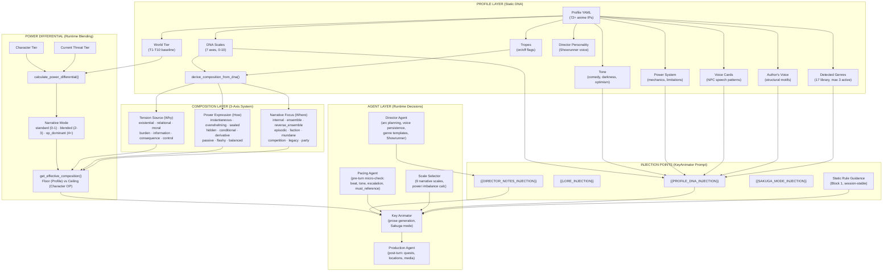
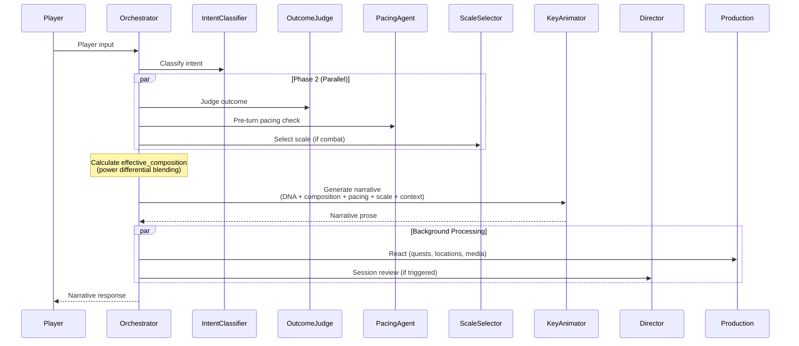

# AIDM v3 — Narrative System Map

A high-level overview of every subsystem that influences **how the story is told**, from static profile data through runtime agent decisions.

---

## Architecture Diagram



---

## 1. Profile Layer — Static IP Identity

| Component | Source File | Purpose |
|---|---|---|
| **NarrativeProfile** | [loader.py](file:///c:/Users/admin/Downloads/animerpg/aidm_v3/src/profiles/loader.py#L23-L92) | Master dataclass. Loaded from YAML at session start. |
| **DNA Scales** | Profile YAML `dna_scales` | 7 numeric axes (0-10) that define the IP's storytelling fingerprint. |
| **Tropes** | Profile YAML `tropes` | Boolean flags for recurring narrative patterns (betrayal, tournament_arc, etc.). |
| **Detected Genres** | Profile YAML `detected_genres` | Up to 3 genres from the 17-genre library. Drive arc templates + scene hooks. |
| **Voice Cards** | Profile YAML `voice_cards` | Per-NPC speech/humor/rhythm profiles. Injected when NPC is in scene. |
| **Author's Voice** | Profile YAML `author_voice` | Structural motifs, sentence patterns, dialogue quirks of the original creator. |
| **Power System** | Profile YAML `power_system` | Name, mechanics, and hard limitation rules for the world's abilities. |
| **World Tier** | Profile YAML `world_tier` | T1-T10 baseline for power differential calculations. |

### The 7 DNA Axes

| Axis | Low (0) | High (10) | What It Steers |
|---|---|---|---|
| Introspection vs Action | Monologue, hesitation | Jump to action | Prose ratio: inner thought vs. movement |
| Comedy vs Drama | Serious, rare humor | Witty banter, absurdist | Tone and comedic relief frequency |
| Power Fantasy vs Struggle | Protagonist dominates | Hard-fought, show pain | Combat outcome feel |
| Tactical vs Instinctive | Chess-like strategy | Gut reactions, emotional power-ups | Combat narration style |
| Hopeful vs Cynical | Good prevails | Pyrrhic victories | Moral framing of outcomes |
| Fast Paced vs Slow Burn | Quick escalation | Linger on atmosphere | Scene length + paragraph count |
| Grounded vs Absurd | Respect physics | Rule of Cool, dramatic excess | How wild power displays get |

Two additional axes appear in derivation logic but aren't primary DNA axes:
- **Ensemble vs Solo** (0-10): Team focus vs. solo protagonist
- **Episodic vs Serialized** (0-10): Anthology vs. continuous narrative

---

## 2. Narrative Composition — The 3-Axis System

> *The core system you asked about.* This is an **always-on direction layer** providing "camera" and tension guidance for every campaign, not just OP characters.

### How It's Derived

```
Profile YAML (explicit composition?)
  ├── YES → use as-is
  └── NO  → derive_composition_from_dna(dna, tropes)
                 ↓
         { tension_source, power_expression, narrative_focus }
```

Source: [derive_composition_from_dna()](file:///c:/Users/admin/Downloads/animerpg/aidm_v3/src/profiles/loader.py#L95-L230)

### Axis 1: Tension Source (The "Why")

| Value | When It Fires | Example IPs |
|---|---|---|
| **existential** | `power_fantasy ≤ 3` (default fallback) | One Punch Man |
| **relational** | `introspection ≤ 4` AND `comedy_drama ≤ 4` | Fruits Basket |
| **moral** | `hopeful_cynical ≥ 7` AND `power_fantasy ≤ 4` | Berserk |
| **consequence** | Tropes: `betrayal` or `faction_politics` | Overlord |
| **control** | Tropes: `berserker_mode` or `corruption` | Mob Psycho |
| **information** | Tropes: `mystery` or `comedy_drama ≥ 7` | Death Note |
| **burden** | Tropes: `tragic_backstory` AND `hopeful_cynical ≥ 6` | Tokyo Ghoul |

### Axis 2: Power Expression (The "How")

| Value | When It Fires | Example IPs |
|---|---|---|
| **instantaneous** | `fast_slow ≤ 3` AND `grounded_absurd ≥ 7` | One Punch Man |
| **sealed** | `grounded_absurd ≤ 3` AND `fast_slow ≥ 7` | Mob Psycho |
| **hidden** | `grounded_absurd ≤ 4` AND `tactical ≤ 3` | Solo Leveling (early) |
| **overwhelming** | `grounded_absurd ≥ 6` AND `episodic_serialized ≥ 7` | Slime |
| **derivative** | `ensemble_solo ≤ 3` | Overlord |
| **conditional** | `tactical ≤ 4` AND `4 ≤ grounded_absurd ≤ 7` | JJK |
| **flashy** | Default fallback | Standard anime action |

### Axis 3: Narrative Focus (The "Where")

| Value | When It Fires | Example IPs |
|---|---|---|
| **ensemble** | `ensemble_solo ≤ 3` | One Piece |
| **internal** | `ensemble_solo ≥ 7` AND `introspection ≤ 3` | Solo Leveling |
| **episodic** | `episodic_serialized ≤ 3` | Cowboy Bebop |
| **faction** | Tropes: `faction_politics` or `nation_building` | Rimuru |
| **mundane** | Tropes: `slice_of_life` or (`comedy ≥ 7` AND `introspection ≤ 3`) | Saiki K |
| **competition** | Tropes: `tournament_arc` | Early DBZ |
| **legacy** | Tropes: `mentor_death` AND `ensemble_solo ≤ 5` | MHA |
| **party** | Default fallback | Standard JRPG party |

### Combinatorial Space

With 7 × 8 × 9 = **504 possible combinations**, the system generates a bespoke narrative archetype per IP without requiring manual curation.

---

## 3. Power Differential — Runtime Blending

At runtime, the **static composition** from the profile is blended with the **character's OP settings** based on how overpowered they are relative to the world.

Source: [get_effective_composition()](file:///c:/Users/admin/Downloads/animerpg/aidm_v3/src/profiles/loader.py#L233-L312)

```
              world_tier ─┐
         character_tier ──┼── calculate_power_differential() ──► differential (int)
     current_threat_tier ─┘                                          │
                                                                     ▼
                                                          get_narrative_mode()
                                                                     │
                          ┌──────────────────────────────────────────┤
                          ▼                  ▼                       ▼
                     STANDARD           BLENDED              OP DOMINANT
                     (0-1 gap)          (2-3 gap)            (4+ gap)
                        │                   │                    │
                    Profile DNA       Char OP tension       Char OP all 3 axes
                    all 3 axes        + OP expression       fully override
                                     + Profile focus
```

| Mode | Tier Gap | Behavior |
|---|---|---|
| **Standard** | 0-1 tiers | Profile DNA drives all 3 axes. Traditional stakes. |
| **Blended** | 2-3 tiers | Character's OP tension + expression, but keep IP's narrative focus. |
| **OP Dominant** | 4+ tiers | Character's OP axes fully override. "Why does winning matter?" |

---

## 4. Agent Layer — Who Uses What

### Director Agent (Showrunner)

- **Runs**: At session boundaries or every 3-8 turns (hybrid trigger)
- **Consumes**: Profile DNA, tropes, detected genres, composition, world state, canonicality constraints
- **Produces**: `DirectorOutput` → arc plan, foreshadowing seeds, voice patterns, pacing guidance
- **Genre Templates**: Hardcoded 17-genre arc structures (shonen training arcs, seinen moral dilemmas, etc.)
- **Voice Persistence**: Extracts and refreshes session voice traits to prevent drift over 100+ turns
- **Showrunner Framework**: Monitors Power Tier changes, Stakes Escalation, Geographic Expansion, Cast Expansion

### Pacing Agent (Pre-Turn Micro-Check)

- **Runs**: Every non-trivial turn, before KeyAnimator
- **Consumes**: Player input, intent, Campaign Bible, arc phase, tension level
- **Produces**: `PacingDirective` → `arc_beat`, `escalation_target`, `tone`, `must_reference`, `avoid`, `foreshadowing_hint`, `strength` (suggestion/strong/override), `phase_transition`

### Scale Selector Agent

- **Runs**: On combat/encounter turns
- **Consumes**: Player tier, opponent tier, situation, profile combat style, arc phase
- **Produces**: `ScaleOutput` → one of **9 narrative scales**: `tactical`, `ensemble`, `spectacle`, `existential`, `underdog`, `slice_of_life`, `horror`, `mystery`, `comedy`
- **Also**: Calculates `PowerImbalanceOutput` with context modifiers

### Key Animator (Prose Generation)

- **Runs**: Every turn
- **Consumes**: Everything above via injection points:
  - `_build_profile_dna()` → DNA scales, tropes, combat, power system, tone, composition, voice cards, author's voice
  - `_build_scene_context()` → location, time, NPCs, tension, director notes, pacing directive
  - `_build_outcome_section()` → intent, success/failure, consequence
  - Sakuga mode injection (climactic moments)
  - Style drift + freshness checks (anti-repetition)
- **Temperature**: 0.7 standard, 0.85 Sakuga mode

### Production Agent (Post-Turn)

- **Runs**: Fire-and-forget after narrative generation
- **Consumes**: Completed narrative, intent, outcome
- **Produces**: Quest tracking, location discovery, media triggers (cutscenes, portraits)

---

## 5. Data Flow — One Complete Turn



---

## 6. Injection Point Summary

All narrative guidance converges in the KeyAnimator's prompt through these template tags:

| Injection Point | Source | Content |
|---|---|---|
| `{{PROFILE_DNA_INJECTION}}` | `_build_profile_dna()` | DNA scales, tropes, combat, power system, composition mode, voice cards, author's voice |
| `{{LORE_INJECTION}}` | ContextSelector + ProfileLibrary | Canon-specific RAG chunks (terminology, power rules, locations) |
| `{{DIRECTOR_NOTES_INJECTION}}` | Director + CampaignBible | Arc instructions, foreshadowing, voice patterns |
| `{{SAKUGA_MODE_INJECTION}}` | Turn pipeline | Choreography/sensory/spectacle guidance (when Sakuga active) |
| Static Rule Guidance (Block 1) | `set_static_rule_guidance()` | OP axis, DNA, genre, scale compatibility (cached per-session) |
| Pacing Directive | PacingAgent output | Beat, tone, escalation, must_reference, avoid |
| Working Memory | Last 10-15 messages | Verbatim recent dialogue (Tier 1 memory) |

---

## 7. Supporting Systems

| System | File | Role |
|---|---|---|
| **Canonicality** | [canonicality.py](file:///c:/Users/admin/Downloads/animerpg/aidm_v3/src/core/canonicality.py) | `timeline_mode`, `canon_cast_mode`, `event_fidelity` — hard constraints from Session Zero |
| **Foreshadowing Ledger** | [foreshadowing.py](file:///c:/Users/admin/Downloads/animerpg/aidm_v3/src/core/foreshadowing.py) | Tracks planted seeds and their resolution status |
| **Memory (3-Tier)** | [memory.py](file:///c:/Users/admin/Downloads/animerpg/aidm_v3/src/context/memory.py) | Verbatim (10-15 msgs) → Episodic (fast decay) → Foundation (permanent) |
| **Rule Library** | [rule_library.py](file:///c:/Users/admin/Downloads/animerpg/aidm_v3/src/context/rule_library.py) | Global OP archetypes, tier guidance, scale rules (ChromaDB) |
| **Profile Library** | [profile_library.py](file:///c:/Users/admin/Downloads/animerpg/aidm_v3/src/context/profile_library.py) | Per-IP lore chunks (ChromaDB, metadata-filtered) |
| **DecisionDetector** | Agency guardrail | Scans narrative for auto-resolved choices, truncates violations |
| **WorldBuilder** | [world_builder.py](file:///c:/Users/admin/Downloads/animerpg/aidm_v3/src/agents/world_builder.py) | Validates + persists player world-building assertions; bidirectional extraction from DM output |
