# AI Video/Image Generation for Dynamic Cutscenes

AIDM already has the narrative intelligence to detect cinematic moments (sakuga system, director arcs, entity extraction). This plan layers **image generation** (Imagen 3) and **video generation** (Veo 3) on top to produce dynamic cutscenes — entirely in the background, without slowing down the turn loop. Media generation is triggered by the **ProductionAgent** (see [implementation plan Phase 2C](file:///C:/Users/admin/.gemini/antigravity/brain/cae23535-87fe-4d9e-9e3a-6bbf9885509a/implementation_plan.md)), which also handles quest tracking and location discovery.

## User Review Required

> [!IMPORTANT]
> **Cost implications**: Imagen 3 costs ~$0.03/image. Veo 3 costs ~$0.05-0.10 per 4-8 second clip. A cutscene (image → video) costs roughly **$0.08-0.13 per trigger**. With cutscenes firing on ~20% of turns, expect **~$0.50-1.50 per hour of gameplay**. This plan includes hard spending caps and per-session budget controls.

> [!WARNING]
> **API availability**: Veo 3/3.1 image-to-video is available via the Gemini API with a Google API key (same key AIDM already uses). However, it may require allowlisting or specific billing tier. We should verify access during implementation.

> [!IMPORTANT]
> **Scope question**: This plan focuses on **gameplay cutscenes** (post-Session Zero). Should we also generate character portrait images during Session Zero character creation? That's a natural extension (the character data is richest at that point) but would be a separate pipeline.

---

## Architecture Overview

```mermaid
graph LR
    A[Turn Loop] -->|narrative + context| PA[ProductionAgent]
    PA -->|tool: trigger_cutscene| C[Media Pipeline BG Task]
    PA -->|tool: quest/location| DB[(Database)]
    C --> D[Imagen 3: Generate Still]
    D --> E[Veo 3: Animate Still → Video]
    E --> F[Save to DB + Disk]
    F -->|SSE notification| G[Frontend Player]
    
    style PA fill:#2d1b69,stroke:#7c3aed
    style C fill:#1e3a5f,stroke:#3b82f6
    style D fill:#1e3a5f,stroke:#3b82f6
    style E fill:#1e3a5f,stroke:#3b82f6
```



**Key design principle**: The media pipeline is **entirely fire-and-forget**. The player receives their narrative immediately. The cutscene generates in the background (15-60 seconds) and arrives via SSE push when ready. The frontend shows a subtle "🎬 Cutscene rendering..." indicator, then displays the media inline.

---

## Proposed Changes

### Component 1: Media Generation Service

New module for direct Imagen 3 + Veo API calls. Uses the existing `google.genai` SDK client.

#### [NEW] [generator.py](file:///c:/Users/admin/Downloads/animerpg/aidm_v3/src/media/generator.py)

Core service with two methods:

```python
class MediaGenerator:
    """Generates images and videos using Google's Imagen 3 + Veo APIs."""
    
    async def generate_image(self, prompt: str, aspect_ratio: str = "16:9") -> Path:
        """Generate a still image via Imagen 3.
        Returns path to saved PNG file."""
        # Uses client.models.generate_images(model="imagen-3.0-generate-002", ...)
    
    async def generate_video(self, image_path: Path, prompt: str, duration: int = 6) -> Path:
        """Generate video from image via Veo 3.
        Returns path to saved MP4 file."""
        # Uses client.models.generate_videos(model="veo-3.0-generate-preview", image=..., ...)
    
    async def generate_cutscene(self, image_prompt: str, motion_prompt: str, ...) -> MediaAssetResult:
        """Full pipeline: prompt → image → video. 
        Orchestrates the two-step process with progress tracking."""
```

- Saves media to `data/media/{campaign_id}/{asset_id}.{png|mp4}`
- Uses `ProgressTracker` for SSE progress updates (reuses existing infrastructure)
- Handles API errors gracefully — a failed cutscene never crashes the turn loop

#### [NEW] [__init__.py](file:///c:/Users/admin/Downloads/animerpg/aidm_v3/src/media/__init__.py)

---

### Component 2: ProductionAgent Media Tools

The **ProductionAgent** (already defined in [Phase 2C](file:///C:/Users/admin/.gemini/antigravity/brain/cae23535-87fe-4d9e-9e3a-6bbf9885509a/implementation_plan.md)) is the post-narrative fire-and-forget agent that already handles quest tracking and location discovery. Media generation is added as **new tools** on the same agent — no new agent needed.

#### [MODIFY] [production_agent.py](file:///c:/Users/admin/Downloads/animerpg/aidm_v3/src/agents/production_agent.py)

Add media tools to the ProductionAgent's tool registry:

```python
# New tools added to ProductionAgent for Phase 4:

class CutsceneType(str, Enum):
    NONE = "none"                    # No cutscene warranted
    CHARACTER_INTRO = "character_intro"      # New significant NPC appears
    LOCATION_REVEAL = "location_reveal"      # Arriving at a dramatic new location  
    ACTION_CLIMAX = "action_climax"          # Sakuga-tier combat/action moment
    EMOTIONAL_PEAK = "emotional_peak"        # Major relationship/emotional beat
    POWER_AWAKENING = "power_awakening"      # First-time power use, transformation
    PLOT_TWIST = "plot_twist"               # Major revelation or twist
    ARC_TRANSITION = "arc_transition"        # Moving between story arcs

# Tool: trigger_cutscene
#   Parameters: cutscene_type, image_prompt, motion_prompt, characters, mood
#   Handler: validates budget → calls MediaGenerator.generate_cutscene() → saves MediaAsset

# Tool: generate_location_visual  
#   Parameters: location_name
#   Handler: reads Location from DB → generates image via Imagen 3 → stores as location art
```

The ProductionAgent's system prompt is expanded to include media classification guidance:
- IP-specific visual vocabulary from the narrative profile
- Cutscene trigger signals: `use_sakuga`, `outcome.narrative_weight`, new entities, emotional milestones
- Budget awareness: agent receives remaining budget and decides whether to trigger

> [!NOTE]
> This replaces the previously planned standalone `CutsceneDirectorAgent`. The ProductionAgent is a better home because it already runs post-narrative, already has the full turn context, and avoids adding yet another agent to the pipeline.

---

### Component 3: Database + Storage

#### [MODIFY] [models.py](file:///c:/Users/admin/Downloads/animerpg/aidm_v3/src/db/models.py)

Add a `MediaAsset` table:

```python
class MediaAsset(Base):
    """Generated media asset (image or video) for a campaign."""
    __tablename__ = "media_assets"
    
    id = Column(Integer, primary_key=True)
    campaign_id = Column(Integer, ForeignKey("campaigns.id"), nullable=False)
    turn_number = Column(Integer, nullable=True)           # Which turn triggered this
    asset_type = Column(String(20))                        # "image" or "video"
    cutscene_type = Column(String(50))                     # CutsceneType enum value
    file_path = Column(String(500), nullable=False)        # Relative path to file
    image_prompt = Column(Text, nullable=True)             # Prompt used for generation
    motion_prompt = Column(Text, nullable=True)            # Veo prompt
    duration_seconds = Column(Float, nullable=True)        # Video duration
    cost_usd = Column(Float, nullable=True)                # Generation cost
    status = Column(String(20), default="pending")         # pending/generating/complete/failed
    created_at = Column(DateTime, default=datetime.utcnow)
    campaign = relationship("Campaign", back_populates="media_assets")
```

Add relationship to Campaign model:
```diff
 class Campaign(Base):
+    media_assets = relationship("MediaAsset", back_populates="campaign", cascade="all, delete-orphan")
```

#### [MODIFY] [state_manager.py](file:///c:/Users/admin/Downloads/animerpg/aidm_v3/src/db/state_manager.py)

Add methods:
- `save_media_asset(...)` — persist a new media record
- `get_media_for_turn(turn_number)` — retrieve media for a specific turn
- `get_media_gallery(limit)` — get recent media assets
- `get_session_media_cost()` — sum costs for budget tracking

---

### Component 4: Orchestrator Integration

#### [MODIFY] [orchestrator.py](file:///c:/Users/admin/Downloads/animerpg/aidm_v3/src/core/orchestrator.py)

Add cutscene generation to the **existing ProductionAgent pipeline** in `_post_narrative_processing`.

The ProductionAgent already runs post-turn, receives the full narrative + context, and uses tools. For Phase 4, its tool registry gains `trigger_cutscene` and `generate_location_visual`. The agent's system prompt gets media classification guidance so it can decide *within the same LLM call* whether to update quests, discover locations, AND generate media.

```python
# In _bg_production_check (already exists from Phase 2C):
# ProductionAgent now has media tools in its registry.
# The agent sees the narrative, decides autonomously whether to call:
#   - complete_quest_objective / update_quest_status (quest tracking)
#   - upsert_location / set_current_location (location discovery)
#   - trigger_cutscene (media generation) ← NEW in Phase 4
#
# Budget check happens inside the trigger_cutscene tool handler:
if session_cost >= self._media_budget_cap:
    return {"error": "Session media budget exhausted", "budget": budget_cap}
```

No separate `cutscene_director.classify()` call needed — the ProductionAgent handles everything in one pass.

---

### Component 5: API Endpoints

#### [MODIFY] [game.py](file:///c:/Users/admin/Downloads/animerpg/aidm_v3/api/routes/game.py)

New endpoints:

| Endpoint | Method | Purpose |
|----------|--------|---------|
| `/api/media/{asset_id}` | GET | Serve a media file (image/video) |
| `/api/media/turn/{turn_number}` | GET | Get media associated with a turn |
| `/api/media/gallery` | GET | Get all media for current campaign |
| `/api/media/sse` | GET | SSE stream for real-time media notifications |
| `/api/media/cost` | GET | Current session media spending |

Also modify the `/api/turn` response model to include an optional `media_pending: bool` flag so the frontend knows a cutscene is being generated.

---

### Component 6: Frontend Media Player

#### [MODIFY] [app.js](file:///c:/Users/admin/Downloads/animerpg/aidm_v3/web/js/app.js)

- After rendering a DM narrative, check for `media_pending` flag
- Show a "🎬 Cutscene rendering..." subtle loading indicator  
- Listen on SSE for media ready notification
- When media arrives, inject an inline video player below the narrative message
- Video auto-plays (muted) with a play/unmute button overlay
- Clicking opens a fullscreen cinematic viewer

#### [MODIFY] [main.css](file:///c:/Users/admin/Downloads/animerpg/aidm_v3/web/css/main.css)

- Cutscene container styling (aspect ratio, rounded corners, glow border for sakuga)
- Loading shimmer animation for the "rendering..." state
- Fullscreen cinematic overlay

---

### Component 7: Settings + Cost Controls

#### [MODIFY] [settings.json](file:///c:/Users/admin/Downloads/animerpg/aidm_v3/settings.json)

Add:
```json
{
  "media_generation": {
    "enabled": false,
    "budget_per_session_usd": 2.00,
    "image_model": "imagen-3.0-generate-002",
    "video_model": "veo-3.0-generate-preview",
    "auto_play": true,
    "quality": "standard"
  }
}
```

`enabled: false` by default — opt-in feature. Users must explicitly turn it on in Settings UI.

---

## Verification Plan

### Automated Tests

#### Cutscene Trigger Classification Test
```bash
cd c:\Users\admin\Downloads\animerpg\aidm_v3
.\venv313\Scripts\python.exe -m pytest tests\test_cutscene_director.py -v
```
- Test that sakuga moments → `trigger_cutscene` tool call with `action_climax` type
- Test that new NPC entity + introduction narrative → `trigger_cutscene` with `character_intro`
- Test that low-stakes dialogue → no `trigger_cutscene` call
- Test budget cap enforcement (mock state returning high cost → tool returns error)
- Uses mocked LLM responses (no API calls needed)

#### Media Generator Service Test
```bash
cd c:\Users\admin\Downloads\animerpg\aidm_v3
.\venv313\Scripts\python.exe -m pytest tests\test_media_generator.py -v
```
- Verify Imagen 3 API call format (mock the `google.genai` client)
- Verify Veo 3 API call format  
- Verify file save to correct path under `data/media/`
- Verify error handling (API timeout, content filtering rejection)

### Manual Verification

> [!NOTE]
> These require an active Google API key with Imagen 3 + Veo access.

1. **Enable media generation** in Settings UI → toggle on, set budget to $0.50
2. **Play a gameplay turn** with a combat action that triggers sakuga
3. **Verify**: "🎬 Cutscene rendering..." appears below the narrative
4. **Wait 15-60 seconds**: Video player should appear inline
5. **Check `data/media/` directory**: PNG + MP4 files should exist
6. **Check Settings → Media Cost**: Should show ~$0.08-0.13 spent
7. **Play several more turns** until budget exhausted → verify no more cutscenes generate
8. **Gallery view**: All generated media should be browsable

### User Testing (Recommended)

I think you'd be the best judge of:
- Whether the cutscene trigger sensitivity is right (too many? too few?)
- Whether the image prompts capture the right IP aesthetic
- Whether the Veo video quality/motion is worth the cost

I'd suggest we calibrate the trigger thresholds and prompt templates together after the initial implementation is working.
